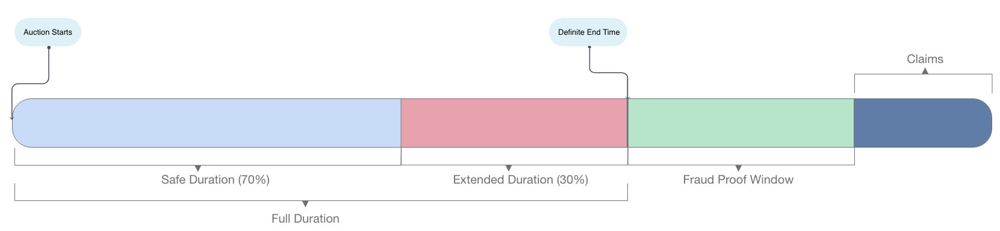

### !!! Untested - DO NOT USE IN PRODUCTION !!!

# [WIP]Kandilli - Optimistic Candle Auctions

Kandilli is a multi-unit candle auction house that uses fraud proofs for low gas usage. 

**Candle auction** is a type of auction in which the exact end time of the auction is unknown. 
https://en.wikipedia.org/wiki/Candle_auction

A **multi-unit auction** is an auction in which several homogeneous items are sold
https://en.wikipedia.org/wiki/Multiunit_auction

## Goals

* Best possible UX for end users
* Eliminate gas wars
* Fair and inclusive price discovery


For achieving these goals we use a similar approach as optimistic rollups. Anyone can post results of the auction, however if anyone finds that the results are incorrect, they are able to challenge the results during fraud proof window.

This way all transactions with the auction house are all very gas efficient.
- **Adding bid**: around ```54k``` gas
- **Increasing bid**: around```34k``` gas
- **Withdrawing lost bid**: around ```50k``` or ```34k``` gas (depending on winners claim status)

## Auction Process
Suppose we have a **3 day long** auction starting at **Monday 00:00:00** and ending at **Thursday 00:00:00**. Also candle snuff percentage is set to **30%**.

_So in this example the actual end time will be sometime between **Wednesday 00:02:24** and **Thursday 00:00:00**._



### Step 0: Auction starts
### Step 1: Bid collection
- Anyone can bid on the auction, can have multiple different bids. 
- Anyone can increase their bids but that also resets the bidding time.
- Minimum bid amount is set to around the gas cost of the claiming of auctioned item. (see target minimum bid amount)
- Bids during the last 30% of the auction duration, could be discarded if candle snuff time is before the bid time.
- Bids cannot be withdrawn

### Step 2: Candle Snuff
- Just after definite end time (Thursday 00:00:00 in the example), anyone can call the snuff function. 
- Snuff function will ask Chainlink VRF to send back a random number. 
- Depending on setting, snuffer may need to have LINK tokens and approve token usage to the contract. 
- Caller of the function will receive a bounty which increases over time up to a max after the auction end time reached. This bounty is not immediately paid because depending on snuff time, auction may not have enough bids to cover the snuff bounty.
- The next auction starts while current one is in the process of settling.

### Step 3: Chainlink VRF returns
- When chainlink calls the callback function with a random number, we now know the exact end time of the auction. 

### Step 4: Winners Proposal
- Once the candle is snuffed at Step 3, anyone can send the winners proposal.
- Proposer will also deposit a set amount of ether to the contract. 
- As we now have data about the total amount of auction bids, we also set bounties for snuff and winners proposal.

### Step 5: Challenge Period
- After winners proposal is sent, we wait for a period of time before the winners are finalized. (fraud proof window)
- During this period, anyone can challenge the proposal. If challenge is successful, deposit is paid to challenger and auction goes back to Step 4 waiting for a new winners proposal.

### Step 6: Auction Ends
- If the winners proposal is not challenged during fraud proof window, auction ends.
- Loser bid owners can withdraw their bids.
- Anyone can call the claim function for winners including winners themselves. See below for more details.

## About Minimum Bid Amount and "Mint for me"

Auctionable item, for example an ERC721 token contract implements IAuctionable which has 2 functions that must be overriden.
```
function settle(address to, uint256 entropy) external;

function getGasCost() external view returns (uint32);
```
When we start a new auction, we try to estimate the gas cost of the settle function by using getGasCost which returns how much gas settle function uses and multiply that with our basefee estimate. We are using basefee observations from the previous auction for estimation. The reason we're doing this is to increase UX of the auction process. For example, for an NFT auction, minimum bid amount will be around minting gas cost for the NFT token. 

Once the claim function is called, we pay the caller the minimum bid amount but settle for the winner of the bid. 
So this way winner doesn't even have to mint the token as bots will call the function when it's profitable to do so. 
Winners will receive their NFTs automagically! 

## Technical details for gas optimization

* All timestamps are saved as `uint40`
* All ether amounts are in gwei precision and saved as `uint48`
  - We ensure bidding cannot have more than gwei precision.
* We limit total amount of winners per auction to type(uint16).max (65535). 
  - For claiming won bids, withdrawing lost bids, challenging the proposal we send winner bid indexes as calldata.
  - Even though normally it's an uint16 array, we send as bytes: packed as 2 bytes per item.
  - This saves a lot of gas on calldata because if we directly send as uint16 array, each item is sent as 32 bytes.
* We use tight struct packing where possible.
* We have 2 seperate function for lost bid withdrawal.
  - One of them can be used before all winning bids are claimed, that one requires winning bids to be sent as calldata, and checks that sent bid index is not in winning list.
  - Second one can only be used after all winning bids are claimed, this one doesn't require sending any calldata and further checks.

## Feature extensions:
- [ ] Lifetime limit for auctioned item count.
- [ ] Dynamic auction item count mechanism. (min/max) items per auction. Change based on previous auction sales.
- [ ] Optional basic snuff mechanism using block.difficulty instead of VRF. (more relevant after the merge as block.difficulty becomes mixHash)


## What's with the name? Kandilli?
Kandil is derived from candēla (latin for "candle"). Kandilli is a neighbourhood name in Istanbul which is famous for its observatory and earthquake research institute.


## Development

First install foundry: https://onbjerg.github.io/foundry-book/getting-started/installation.html 

### Set up
```
git clone https://github.com/ualtinok/kandilli
bun install
forge build
```

### Test

```
forge test
```
